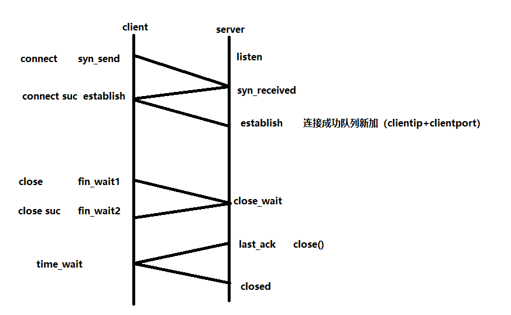

# 1. 3次握手和4次挥手

# 2. select|epoll模型对比异步io模型
## 2.1 多路复用

1. poll加入一个socket
2. 网卡如果有数据，通过DMA方式放入到对应socket的读buffer中
3. 硬件中断唤醒poll所在线程
4. 用户代码调用read方法，cpu参与从内核socket的读缓冲区中拿数据到用户态buffer

## 2.2 aio

1. aio调用，指定一个用户buffer
2. socket加入aio队列中
3. 网卡有数据后，DMA方式放入socket的buffer
4. 此时aio队列做出响应，将socket中的buffer拷贝到用户buffer
5. aio操作完成后，唤醒aio方法绑定的回调代码

## 2.3 kqueue+aio
https://mendylee.gitbooks.io/geeker-study-courses/content/gao-shou-cheng-chang-pian/yi-bu-i-o-mo-xing-he-lock-free-bian-cheng.html

https://zhuanlan.zhihu.com/p/112162403

https://www.freebsd.org/cgi/man.cgi?query=aio&sektion=4&apropos=0&manpath=FreeBSD+12.1-RELEASE+and+Ports

https://www.freebsd.org/cgi/man.cgi?kqueue

https://blog.csdn.net/hellozhxy/article/details/80820257

https://blog.csdn.net/Timeinsist/article/details/80978713 
https://blog.csdn.net/weixin_33787529/article/details/86243040 
https://www.ibm.com/developerworks/cn/aix/library/1105_huangrg_kqueue/

https://www.ibm.com/developerworks/cn/aix/library/1105_huangrg_kqueue/

https://www.cnblogs.com/FG123/p/5256553.html

# 3. sigpipe 如何产生
1. client进程消失，会发送一个close fin_wait
2. server端收到了fin，处于close_wait 
3. server写入信息，给对方发送数据，会收到RST重置
4. 此时再次写入的时候，socket因收到RST，断裂了，会发出sigpipe信号  
另外如果网络链路有问题的话，也会导致client和server端之间链接断裂

# 4. 事件
## 4.1 可读
1. socket可读缓冲区有数据
2. listen的socket，新的client三次握手后，会将对应socket对象放入监听完成队列中
3. 收到了fin请求（对方调用了close方法），此时进行read时(可读)，就会返回0
4. socket内部异常
## 4.2 可写
1. socket可写缓冲区有空间
2. 收到fin后，再写，会收到RST重置，此时再写(可写)，触发sigpipe
3. socket异常
## 4.3 异常
带外数据

# 2. socket+epoll交互服务端模型

